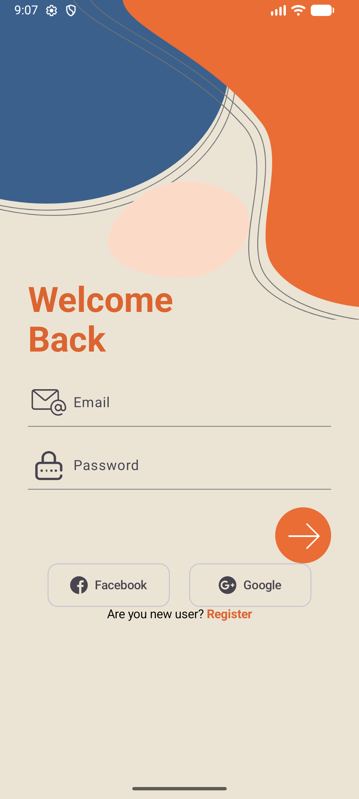
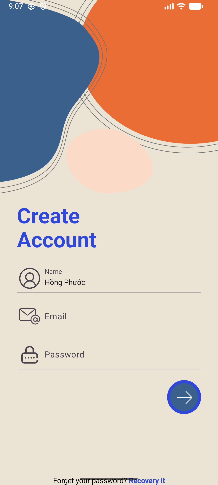
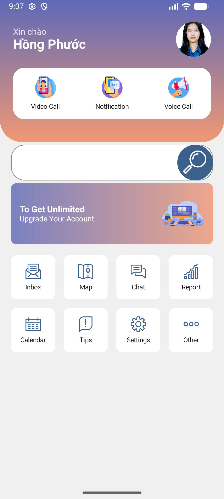

# LTMB_BT2_login_register

Đây là một dự án ứng dụng Android đơn giản minh họa các chức năng đăng nhập và đăng ký người dùng, được xây dựng bằng Kotlin và Jetpack Compose.

## ✨ Tính năng

- Màn hình đăng nhập cho người dùng hiện tại.
  
- Màn hình đăng ký cho người dùng mới.
  
- Màn hình trang tổng quan (Dashboard) sau khi đăng nhập thành công.
  

## 🛠️ Công nghệ sử dụng

- **Ngôn ngữ:** [Kotlin](https://kotlinlang.org/)
- **UI Toolkit:** [Jetpack Compose](https://developer.android.com/jetpack/compose)
- **Kiến trúc:** MVVM (Model-View-ViewModel) cơ bản
- **Điều hướng:** [Navigation for Compose](https://developer.android.com/jetpack/compose/navigation)

## 📂 Cấu trúc dự án

- `app/src/main/java/com/example/baitap_bt2/`
  - `MainActivity.kt`: Activity khởi chạy chính.
  - `LoginScreen.kt`: Giao diện màn hình đăng nhập.
  - `RegisterScreen.kt`: Giao diện màn hình đăng ký.
  - `DashboardScreen.kt`: Giao diện màn hình trang tổng quan.
  - `Navigation.kt`: Quản lý điều hướng giữa các màn hình.
- `app/src/main/res/drawable/`: Chứa các tài nguyên hình ảnh, icon và background.
/