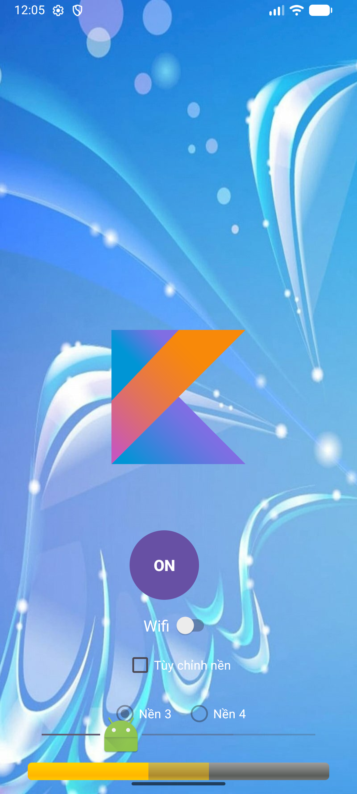
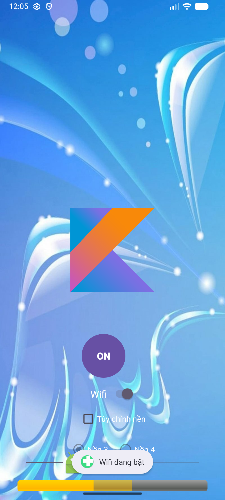
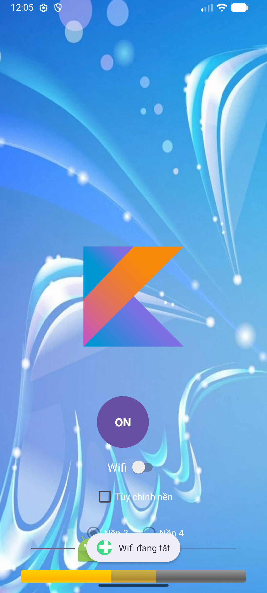
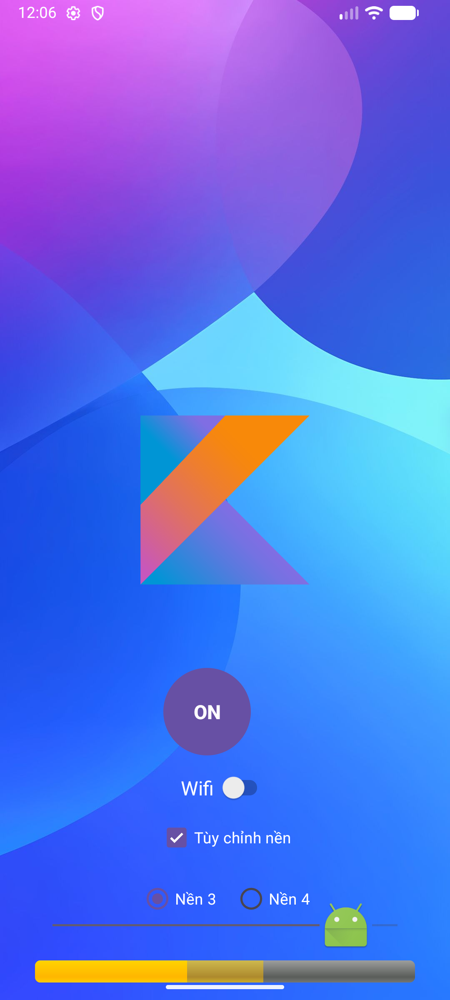
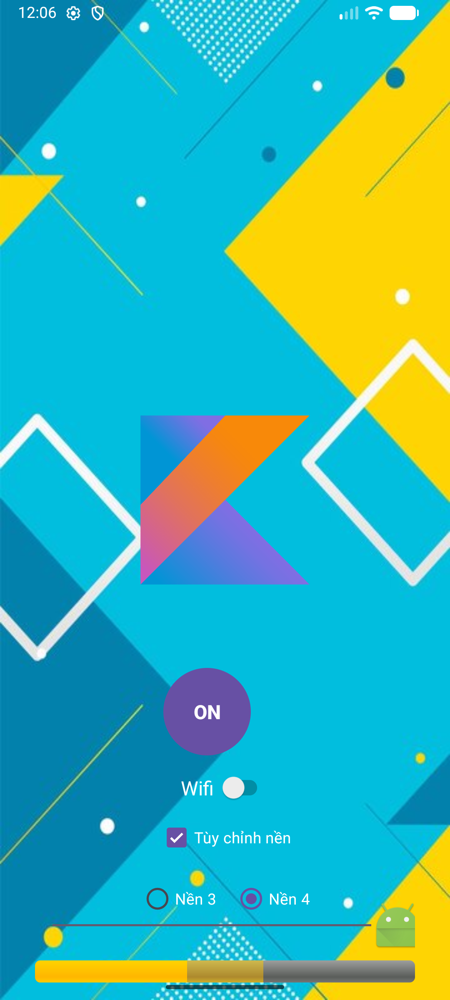
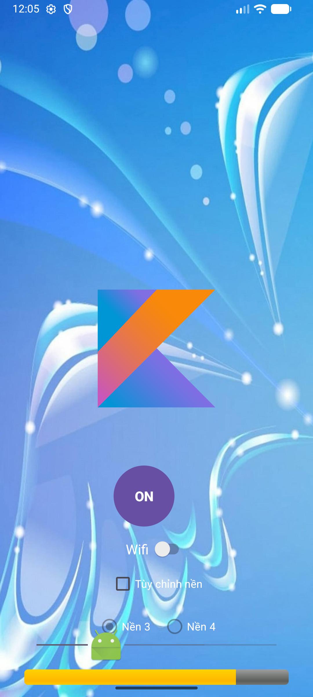

# Project Android: Bài Tập Tổng Hợp UI Controls

Đây là một dự án Android đơn giản nhằm mục đích demo và thực hành việc sử dụng các thành phần giao diện người dùng (UI Controls) cơ bản trong lập trình di động.

## Các Tính Năng & Controls Đã Thực Hiện

Ứng dụng này bao gồm việc triển khai và xử lý sự kiện cho các control sau:

- **ImageView**: Hiển thị một ảnh tĩnh (logo Kotlin) ở trung tâm màn hình. Kích thước ảnh được điều chỉnh để vừa với chiều rộng màn hình mà không làm vỡ tỷ lệ.
  
- **Button**: Một nút tròn với chữ "ON". Khi được nhấn, nút này sẽ kích hoạt `ProgressBar` tự động chạy.
  
- **Switch**: Một công tắc bật/tắt có nhãn "Wifi". Khi trạng thái thay đổi, một thông báo (`Toast`) tương ứng ("Wifi đang bật" / "Wifi đang tắt") sẽ được hiển thị.
  
  
- **CheckBox** và **RadioGroup**: Hai control này phối hợp với nhau để thay đổi ảnh nền của ứng dụng:
  - `CheckBox` ("Tùy chỉnh nền") đóng vai trò là công tắc chính để bật/tắt chế độ thay đổi nền.
  - `RadioGroup` chỉ được kích hoạt khi `CheckBox` được chọn, cho phép người dùng chọn giữa hai ảnh nền khác nhau (`Nền 3` và `Nền 4`).
  - Khi `CheckBox` không được chọn, ứng dụng sẽ quay về ảnh nền mặc định.
    
    
- **ProgressBar**: Một thanh tiến trình nằm ngang. Khi người dùng nhấn nút "ON", thanh tiến trình sẽ tự động chạy trong 10 giây và sau đó hiển thị thông báo "Hết giờ".
  
- **SeekBar**: Một thanh trượt cho phép người dùng tương tác. Mọi thay đổi về giá trị, cũng như các sự kiện bắt đầu và kết thúc trượt, đều được ghi lại vào **Logcat** với tag là "AAA".

- **Options Menu**: Một menu (thường có biểu tượng 3 chấm) ở góc trên bên phải màn hình, chứa các mục: `Setting`, `Share`, và `Logout`. Khi người dùng chọn một mục, một `Toast` tương ứng sẽ hiện lên.

## Cách Chạy Project

1.  Mở project bằng phiên bản Android Studio mới nhất.
2.  Đợi cho project đồng bộ Gradle thành công.
3.  Trên thanh công cụ, đảm bảo rằng cấu hình chạy đang được chọn là **`app`**.
4.  Nhấn nút **Run (▶️)** để biên dịch và cài đặt ứng dụng lên máy ảo hoặc thiết bị thật.
